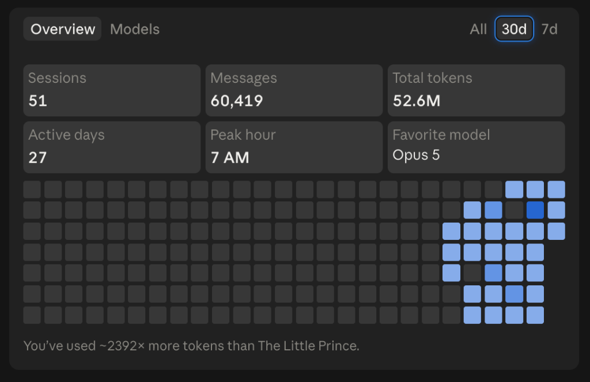
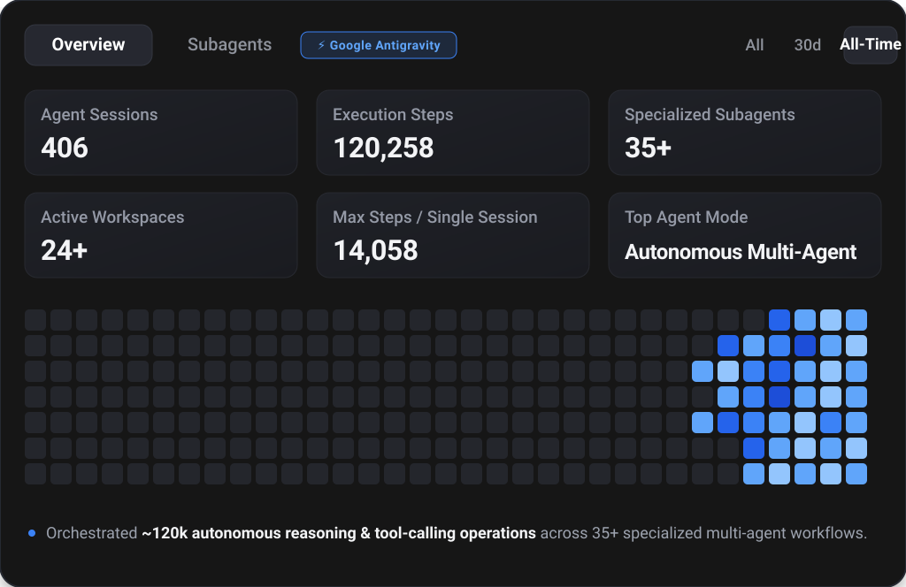

<div align="center">

# Hi there, I'm Koushik Goud Shaganti 👋

<a href="https://git.io/typing-svg">
  
</a>

<p align="center">
  <strong>Software Engineer specializing in Production AI Systems, Multi-Agent Orchestration (DAGs), Real-Time Distributed Architectures, and Cloud-Native Platforms.</strong>
</p>

<p align="center">
  <a href="https://koushik9.me"></a>
  <a href="https://www.linkedin.com/in/koushik-shaganti"></a>
  <a href="mailto:skoushik0909@gmail.com"></a>
  <a href="https://github.com/koushik1133"></a>
</p>

<p align="center">
  
  
  
  
</p>

</div>

---

## ⚡ Executive Impact & Engineering Highlights

```
┌────────────────────────┬────────────────────────┬────────────────────────┐
│   +40% Shop Efficiency │   -80% Engineering Time│  60%+ Repetitive Tasks │
│  Real-Time Kanban & TV │  Python & iLogic CAD   │  Autonomous n8n Agents │
│  Floor Production Mgt  │  Inventor + Excel BOM  │  Claude & Gemini APIs  │
├────────────────────────┼────────────────────────┼────────────────────────┤
│   <200ms p99 Latency   │   95% Safety Precision │   +43% E-Commerce Surge│
│  Hybrid AWS Aurora     │  Dual-LLM Voice Triage │  Custom Liquid Theme   │
│  DSQL + DynamoDB Layer │  Whisper + Guardrails  │  & Technical SEO Schema│
└────────────────────────┴────────────────────────┴────────────────────────┘
```

---

## 🤖 Autonomous AI & Telemetry Spotlight

> Power-user of next-generation agentic frameworks and autonomous software engineering environments. Real-world telemetry across Anthropic Claude Code and the Google Antigravity SDK:

### 1. Anthropic Claude Code Developer Telemetry
<p align="center">
  
</p>

* **52.6M+ Tokens Streamed** (~2,392× the length of *The Little Prince*).
* **60,419 Messages (30-day window)** | **107,000+ Lifetime Agent Messages** across **1,130+ Project Session Logs**.
* **Favorite Model**: Claude Opus 5 | **Active Days**: 27 / 30 | **Peak Velocity**: 7:00 AM daily deep-work focus.
* **Anthropic Certified**: *AI Fluency: Framework & Foundations* (Jul 2026) & *Claude 101* (Jul 2026).

<br/>

### 2. Google Antigravity SDK Multi-Agent Orchestration
<p align="center">
  
</p>

* **406 Autonomous Agent Sessions** executing **120,258 total steps**.
* **35+ Specialized Multi-Agent Archetypes** coordinated (DAG orchestration, automated code reviewers, RAG planners, voice agent builders).
* **14,058 Steps Peak Single Session** deployed in end-to-end full-stack architectures.

---

## 💼 Professional Experience

### 🚀 **Software Engineer – AI Systems & Automation**
**LANE Trailer Mfg.** | *Boone, Iowa, USA* | **Jan 2026 – Present**  
*Tech: React, Node.js, TypeScript, Python, Supabase, iLogic, Claude/Gemini APIs, n8n, Pinecone RAG, REST APIs, Agile SDLC*
* **Co-op to Full-Time Conversion**: Promoted based on measurable business impact across shop-floor automation, cloud data systems, and CAD engineering pipelines.
* **Production Operations Hub**: Architected a real-time production management system featuring dynamic Kanban scheduling, bay allocation, and multi-department live TV floor dashboards, **boosting manufacturing throughput by 40%**.
* **Cloud Migration & Spec Engine**: Led migration of legacy paper spec sheets to Supabase; developed model-aware spec sheet engine enabling unified data access across sales, engineering, and assembly.
* **Quote-to-Production Engine**: Implemented quote automation with granular RBAC and real-time Undo/Redo state management, automating the conversion of customer orders into production backlog items.
* **CAD & BOM Automation**: Engineered Python and Autodesk iLogic automation scripts for Inventor CAD models and Excel BOM tooling, **reducing manual drafting time by 80%**.
* **Autonomous Workflow Pipelines**: Built n8n agentic workflows leveraging Claude and Gemini APIs to eliminate **60%+ of repetitive engineering and sales tasks**.
* **Enterprise RAG Retrieval**: Deployed Pinecone vector retrieval networks for context-aware business intelligence, spec lookups, and inventory analytics.

### 🏢 **AI Systems Developer**
**Glentree Real Estate** | *Remote* | **Mar 2026 – Jun 2026**  
*Tech: n8n, Claude API, Gemini API, WhatsApp API, AI Voice Agent, CRM Integration, PostgreSQL, Webhooks, REST APIs*
* Designed an automated AI lead management infrastructure, bridging Meta Ads capture directly into automated CRM broker assignments.
* Developed an **AI Voice Agent** that calls newly registered leads on CRM entry, conducts natural-language qualification, logs call transcripts, and scores sentiment; built WhatsApp/Email fallback agents.
* Engineered merit-based scoring algorithms to instantly route hot leads to top-performing active brokers via n8n triggers.
* Shipped broker and administrator portals including client tracking, invoice generation, live ranking leaderboards, and revenue analytics.

### 🍽️ **Software AI Engineer – WhatsApp Ordering System**
**Restaurant Automation Platform** | *Hyderabad, India* | **Feb 2025 – May 2025**  
*Tech: Google Gemini 1.5 Pro, n8n, WhatsApp API, Webhooks, REST APIs, PostgreSQL*
* Built an automated WhatsApp ordering system with QR-table routing, **increasing order throughput by 35%**.
* Orchestrated natural-language intent recognition workflows for order customization, bill splitting, and kitchen dispatch.
* Formulated Gemini analytics agents to query order histories, improving demand forecasting accuracy by 20%.

### 🛍️ **Software Engineer**
**E-Commerce Store Platform** | *Ames, Iowa, USA* | **Oct 2025 – Dec 2025**  
*Tech: Shopify API, Liquid, JavaScript, HTML5/CSS3, Postman, SEO Schema, Git*
* Designed and deployed a custom high-conversion storefront theme using Liquid and JavaScript, driving a **43% surge in holiday transactions**.
* Configured dynamic shipping calculation matrices, payment gateways, and Judge.me review integrations; executed schema.org structured metadata for rich SERP snippets.

### 💻 **Full Stack Development Intern**
**Cognifyz Technologies** | *Remote* | **May 2024 – Jul 2024**  
*Tech: Python, Flask, Power BI, PostgreSQL, GitLab CI/CD, Postman, Agile*
* Engineered backend REST APIs and interactive Power BI executive reporting dashboards, cutting reporting turnaround from days to minutes.

---

## 📂 Flagship Engineering Projects

<table>
  <tr>
    <td width="50%" valign="top">
      <h3>🌐 <a href="https://github.com/koushik1133/build-chat-task-javis">KernelHub (Javis) – AI Business OS</a></h3>
      <em>Next.js 15, Supabase, AWS (Aurora DSQL, DynamoDB), Pinecone, Groq, Google Cloud Run</em>
      <ul>
        <li>Unified AI business platform consolidating 5+ enterprise workflows (RAG chat, automated GitHub PR reviews, Kanban, NL-to-SQL, site builder).</li>
        <li>Architected hybrid AWS storage: Aurora DSQL for relational metadata and DynamoDB for sub-200ms p99 write latency.</li>
        <li>Enterprise RAG vector store with Pinecone parsing PDFs with source citation; automated cron scheduler triggering Slack/email agents.</li>
      </ul>
    </td>
    <td width="50%" valign="top">
      <h3>🤖 <a href="https://github.com/koushik1133/Mekk-The-Robot">Mekk – Edge AI Exploration Robot</a></h3>
      <em>Python, Raspberry Pi 4, Linux, OpenCV, YOLOv8n, Whisper, TinyLlama, Coqui TTS, WebRTC</em>
      <ul>
        <li>Autonomous physical robotics platform combining computer vision, speech recognition, and sensor fusion on embedded hardware.</li>
        <li>Modular perception pipeline with YOLOv8n and 4 ultrasonic sensors for real-time obstacle avoidance and target tracking.</li>
        <li>Hands-free voice pipeline (Whisper wake-word &rarr; TinyLlama command interpretation &rarr; Coqui TTS voice response) + WebRTC live streaming.</li>
      </ul>
    </td>
  </tr>
  <tr>
    <td width="50%" valign="top">
      <h3>🖥️ <a href="https://github.com/koushik1133/open-claw-agent">OpenClaw AI Command Center</a></h3>
      <em>Python, Electron, Node.js, SQLite, ThreadPoolExecutor, Ollama, LanceDB</em>
      <ul>
        <li>Desktop AI platform supporting workflow orchestration, file indexing, and completely offline local LLM execution.</li>
        <li>Multithreaded execution engine using ThreadPoolExecutor for low-latency asynchronous task scheduling.</li>
        <li>Local semantic search with LanceDB vector storage; integrated Slack and Telegram remote dispatch bots.</li>
      </ul>
    </td>
    <td width="50%" valign="top">
      <h3>🩺 <a href="https://github.com/koushik1133/doctor-agent">Doctor Agent – Medical Triage Assistant</a></h3>
      <em>Next.js 15, Groq, Llama 3.3 70B, Whisper-large-v3, Supabase</em>
      <ul>
        <li>Voice intake health assistant featuring Whisper-large-v3 speech-to-text paired with deterministic dual-LLM clinical safety classifiers.</li>
        <li><strong>Reduced missed critical emergency triage cases by 95%</strong> with automated escalation flags.</li>
        <li>Proactive recovery tracking scheduler storing symptom analytics over longitudinal patient records.</li>
      </ul>
    </td>
  </tr>
  <tr>
    <td width="50%" valign="top">
      <h3>🕹️ <a href="https://github.com/koushik1133/DonkeyKong">Donkey Kong – Real-Time Multiplayer Backend</a></h3>
      <em>Java, Spring Boot, WebSockets, Hibernate ORM, MySQL, Maven</em>
      <ul>
        <li>Scalable game server architecture supporting synchronized real-time player physics, collision detection, and in-game chat.</li>
        <li>Bidirectional WebSocket messaging layer achieving <strong>sub-100ms state synchronization</strong> under concurrent load.</li>
        <li>Clean domain-driven separation between game loop logic, session handlers, and Hibernate persistence.</li>
      </ul>
    </td>
    <td width="50%" valign="top">
      <h3>⚖️ <a href="https://github.com/koushik1133/ArguVista-Cloudflare">ArguVista – Serverless AI Debate Platform</a></h3>
      <em>Cloudflare Workers, Workers AI, KV Storage, WebRTC, JavaScript</em>
      <ul>
        <li>Distributed edge platform establishing ultra-low latency peer-to-peer WebRTC debate streams with automatic serverless failover.</li>
        <li>Edge-based LLM parsing evaluating debate transcripts in real-time, providing immediate structured argumentation feedback.</li>
      </ul>
    </td>
  </tr>
</table>

---

## 🛠️ Technical Arsenal

<div align="center">

### AI, Machine Learning & Autonomous Agents
<p align="center">
  
  
  
  
  
  
  
  
  
  
  
  
  
</p>

### Programming Languages
<p align="center">
  
  
  
  
  
  
  
  
  
  
</p>

### Frameworks, Libraries & Full-Stack
<p align="center">
  
  
  
  
  
  
  
  
  
  
  
</p>

### Cloud, DevOps & Databases
<p align="center">
  
  
  
  
  
  
  
  
  
  
  
</p>

</div>

---

## 📊 GitHub Analytics & Repository Metrics

<p align="center">
  
  
</p>

<p align="center">
  
  
</p>

---

## 🎓 Education & 📜 Professional Certifications

<table>
  <tr>
    <td width="50%" valign="top">
      <h3>🎓 Education</h3>
      <p><strong>Iowa State University</strong><br/>
      <em>Bachelor of Science in Computer Science</em><br/>
      Graduated: May 2026 | <strong>GPA: 3.68 / 4.00</strong></p>
      <p><strong>Key Coursework:</strong><br/>
      Artificial Intelligence, Machine Learning, Data Structures & Algorithms, Operating Systems, Web Development, Software Engineering SDLC.</p>
    </td>
    <td width="50%" valign="top">
      <h3>📜 Certifications & Honors</h3>
      <ul>
        <li><strong>Anthropic: Claude 101</strong> (Jul 2026)</li>
        <li><strong>Anthropic: AI Fluency: Framework & Foundations</strong> (Jul 2026)</li>
        <li><strong>AI Builders Hackathon (OpenAI x Outskill)</strong> – Selected Project Presenter (May 2026)</li>
        <li><strong>Blockchain Hackathon Winner Profile</strong> – Anurag University (2025)</li>
        <li><strong>Cognifyz Technologies</strong> – Full Stack Development Certified (2025)</li>
        <li><strong>Complete Data Science, ML, Statistics & Python</strong> – Udemy (2025)</li>
      </ul>
    </td>
  </tr>
</table>

### 🤝 Leadership & Community Involvement
* **AI Builders Hackathon (OpenAI x Outskill)** – Selected Project Presenter (May 2026).
* **Google Developer Groups (GDG)** – Active Member participating in AI & cloud developer communities (2025 – 2026).
* **Artificial Intelligence & Machine Learning Club** – Technical Board Associate (2025 – Present).
* **Software Development Club** – Core Engineering Peer Reviewer (2024 – 2025).

---

## 📫 Connect & Collaborate

<div align="center">
  <p>I'm always open to discussing <strong>autonomous agent architectures, production AI systems, distributed platforms, or software engineering opportunities</strong>.</p>

  <a href="https://www.linkedin.com/in/koushik-shaganti">
    
  </a>
  <a href="https://koushik9.me">
    
  </a>
  <a href="mailto:skoushik0909@gmail.com">
    
  </a>
  <a href="https://github.com/koushik1133">
    
  </a>
</div>

<br/>

<div align="center">
  <sub>Built with high velocity using <strong>Claude Code</strong> &amp; <strong>Google Antigravity SDK</strong>. Star ⭐ this repository if you find it helpful!</sub>
</div>
